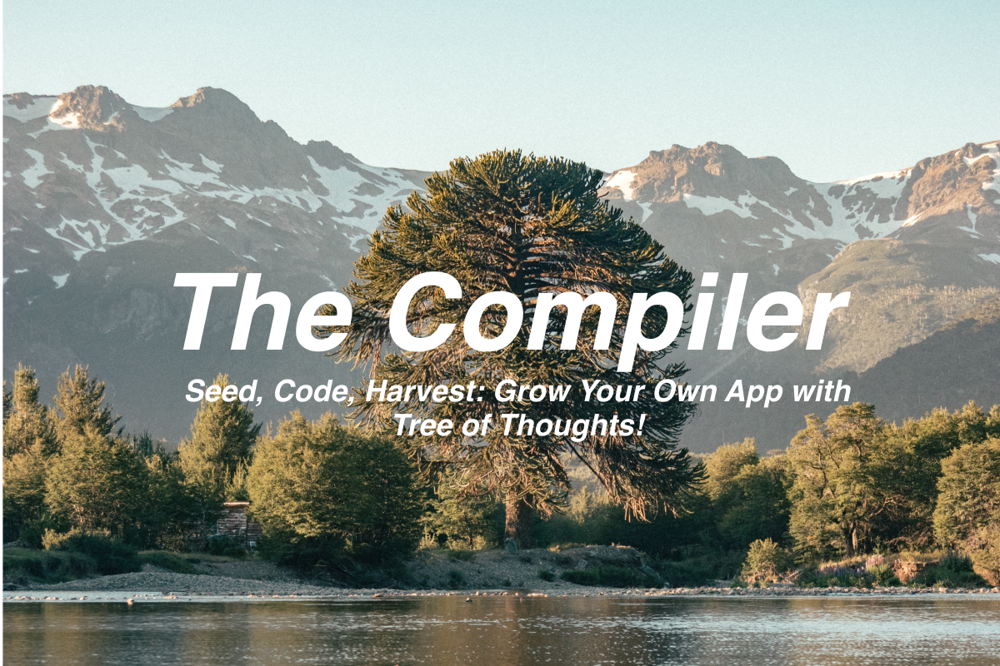

# Agora
"We are all apprentices in a craft where no one ever becomes a master." - Ernest Hemingway

We at Agora share Hemingway's sentiment. We are an open source Multi-Modality AI Research Organization, a humble group of pioneers striving to broaden Humanity's horizons. 


[Join our discord and contribute to this grand project!](https://discord.gg/qUtxnK2NMf)

# The-Compiler
"It is not enough that you should understand about applied science in order that your work may increase man's blessings." - Robert Oppenheimer



Welcome, creators, to a new era of programming. Welcome to _The Compiler_, our brainchild nestled under the Tree of Thoughts (ToT) paradigm. We stand at the precipice of a revolution, about to reshape how we approach programming. 

Just as Oppenheimer foresaw the transformative power of his work, we see the transformative potential of _The Compiler_. It will not just code for you, it will redefine how we interact with software creation.

## Overview 

The Compiler, an integral part of our ToT framework, employs Large Language Models (LLMs) to carry your dreams from mere abstraction to the tangible reality of working code. 

Here's the essence of our workflow:

1. **Seed**: You plant the seed - a high-level specification for the software you desire.
2. **Grow**: We cultivate your idea, using an LLM to craft a suite of unit tests that will serve as the litmus test for the code.
3. **Blossom**: We run the ToT LLM, letting your idea bloom into fully-formed code, using the unit tests to guide its development.
4. **Harvest**: A working program ripe for use!

# Usage

There are 2 methods, `git clone` and or `pip install the-compiler`here are the usage instructions for both methods:

## Git Clone Method

To start with, clone the GitHub repository by running the following command in your terminal:

```bash
git clone https://github.com/kyegomez/the-compiler.git
```

Navigate into the project directory:

```bash
cd the-compiler
```

Install the dependencies:

```bash
pip install -r requirements.txt
```

Use the application. Here's an example usage:

```python
from the_compiler import Architect, Developer, UnitTester

# Initialize the components
architect = Architect()
developer = Developer()
unit_tester = UnitTester()

# Define the task
task = "Create a simple calculator in Python"

# Use the Architect to create the architecture and breakdown
architecture, breakdown = architect.create_architecture(task)

# Use the Developer to write the code
code = developer.write_code(breakdown)

# Use the UnitTester to create the tests
tests = unit_tester.create_tests(code)

# Print the code and tests
print("Code:", code)
print("Tests:", tests)
```

## Pip Install Method

First, install The Compiler via pip:

```bash
pip install the-compiler
```

Then, you can start using it in your Python scripts. Here's an example:

```python
from the_compiler import Architect, Developer, UnitTester

# Initialize the components
architect = Architect()
developer = Developer()
unit_tester = UnitTester()

# Define the task
task = "Create a simple calculator in Python"

# Use the Architect to create the architecture and breakdown
architecture, breakdown = architect.create_architecture(task)

# Use the Developer to write the code
code = developer.write_code(breakdown)

# Use the UnitTester to create the tests
tests = unit_tester.create_tests(code)

# Print the code and tests
print("Code:", code)
print("Tests:", tests)
```

These examples show the basic usage of The Compiler's classes. Please adjust according to your needs and don't forget to handle possible exceptions.

## Architecture

The Compiler, leveraging the Tree of Thoughts paradigm, consists of several primary components, including the Specification Parser, Thought Decomposer, Thought Generator, State Evaluator, and the Search Algorithm. 

1. **Specification Parser**: This interprets your high-level input specifications and translates them into a format that the Thought Decomposer can understand and work with.

2. **Thought Decomposer**: This component breaks down the programming problem into manageable "thoughts" or steps.

3. **Thought Generator**: It generates potential thoughts or steps from the current state using two strategies, either sampling thoughts independently or proposing thoughts sequentially.

4. **State Evaluator**: It evaluates the progress of different states towards solving the programming problem, acting as a heuristic for the Search Algorithm.

5. **Search Algorithm**: This module determines which states to keep exploring and in which order. It employs either Breadth-First Search (BFS) or Depth-First Search (DFS), depending on the nature of the problem.

# Roadmap

Our grand ambition with The Compiler is to construct an AI system that can develop and maintain any software project with little to no human assistance. The journey is a significant one, which we have broken down into three phases:

1. **Phase 1 - Autonomous Code Generation**: Achieve a level of proficiency where the system can autonomously develop software given a high-level description and tests.

2. **Phase 2 - Autonomously Maintaining and Refactoring Existing Code**: Develop the system to handle existing codebases, to maintain them and refactor the code to improve efficiency and readability.

3. **Phase 3 - Advanced Learning and Super Intelligence**: This phase aims for the AI to start learning from its experiences, improving its coding abilities and understanding complex code designs, ultimately working towards achieving super intelligence.

# Key Milestones

## Phase 1 - Autonomous Code Generation

- **M1.1** - Enhance the ability of The Compiler to understand complex high-level descriptions.
- **M1.2** - Improve unit test generation to cover all edge cases and potential bugs.
- **M1.3** - Improve the code generator to produce efficient, clean, and highly readable code.
- **M1.4** - Create a comprehensive benchmarking system to evaluate the efficiency, accuracy, and quality of the generated code.
- **M1.5** - Implement feedback loops for constant learning and improvement.

## Phase 2 - Autonomously Maintaining and Refactoring Existing Code

- **M2.1** - Develop the ability of The Compiler to understand existing codebases.
- **M2.2** - Enable The Compiler to identify areas of the code that require maintenance or refactoring.
- **M2.3** - Empower The Compiler to refactor code to improve its efficiency and readability.
- **M2.4** - Develop a testing system to ensure that the refactored code passes all original and additional tests.

## Phase 3 - Advanced Learning and Super Intelligence

- **M3.1** - Develop the AI's ability to learn and improve from its own coding experiences.
- **M3.2** - Implement complex code design understanding in the AI.
- **M3.3** - Achieve a level of super intelligence, where the AI can autonomously develop advanced software with minimal human assistance.

# Bounty Program

As part of our open-source ethos, we invite you to participate in our Bounty Program. The following tasks are open for bounty:

- **B1** - Enhance The Compiler's ability to understand complex high-level descriptions.
- **B2** - Improve unit test generation to cover all edge cases and potential bugs.
- **B3** - Develop the ability of The Compiler to understand existing codebases.
- **B4** - Enable The Compiler to refactor code to improve its efficiency and readability.
- **B5** - Develop the AI's ability to learn and improve from its own coding experiences.

Each of these bounties has its own reward, and we are grateful for your contributions. Together, we can revolutionize the world of programming with _The Compiler_!

In case you need more guidance, please don't hesitate to reach out on our Discord channel. Your support and contributions will take us closer to our mission of advancing humanity.

## Share The Compiler

If you find this project exciting and think others might benefit from it, feel free to share it. Use the buttons below to share it on various social media platforms:

- [Share on Twitter](http://twitter.com/share?text=Check%20out%20The%20Compiler%20project%20on%20GitHub!%20It%20allows%20you%20to%20autonomously%20create%20programs%20using%20abstract%20specifications.&url=https://github.com/kyegomez/the-compiler)
- [Share on LinkedIn](http://www.linkedin.com/shareArticle?mini=true&url=https://github.com/kyegomez/the-compiler&title=The%20Compiler%20Project&summary=This%20project%20is%20a%20revolution%20in%20autonomous%20programming!%20Check%20it%20out%20on%20GitHub.)
- [Share on Facebook](http://www.facebook.com/sharer.php?u=https://github.com/kyegomez/the-compiler)

Let's revolutionize the world of programming together with _The Compiler_!


As Oppenheimer quoted from the Bhagavad Gita upon the successful test of his creation, "Now I am become Death, the destroyer of worlds." We, too, hope to become destroyers of worlds, the old worlds of antiquated programming practices, replacing them with a new era of coding. Join us in this journey.


